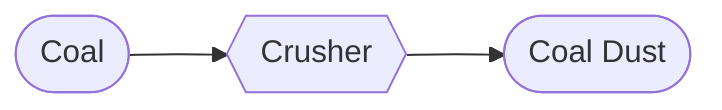

Sure, I'll remove the labels and ensure that buildings are nodes as well. Here are the updated diagrams:

# Mining
## Hematite Mining

## Coal Mining

## Quartz Mining

# Crushing
## Coal Crushing

## Hematite Crushing

## Quartz Crushing

# Sieving
## Iron Sieving

## Quartz Sieving

# Mixing
## Amethyst Dust

# Polishing

## Hematite Polishing

## Diamond Polishing

# Compression
## Rough Diamond

## Rough Amethyst

